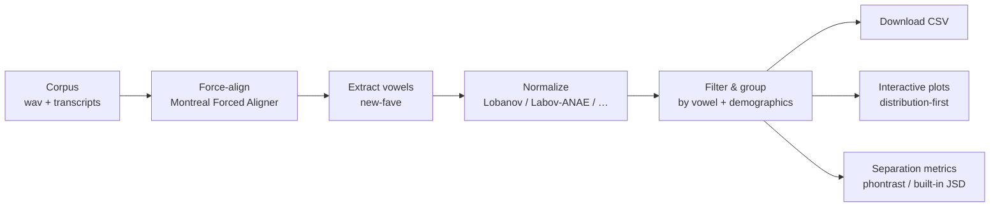

# 🧪 Vowelchemy

**Turn conversational speech corpora into normalized, analyzable vowel data — in one app.**

Vowelchemy is a lab-friendly tool for sociophonetic vowel analysis. Point it at
your recordings and transcripts and it walks you through the whole pipeline:
force-alignment, formant extraction, normalization, filtering, interactive
plots, and category-separation metrics — with sensible defaults at every step,
and a demo dataset so you can learn the workflow before touching real data.



Every stage checks whether its work is already done — if your TextGrids are
aligned, or you already have an extracted-vowel CSV, you can skip straight
ahead.

---

## Get started

### Without a terminal

- **Download the app.** Get `Vowelchemy-macOS.zip` or `Vowelchemy-Windows.zip`
  from the [Releases page](https://github.com/berrygrant/vowelchemy/releases),
  unzip, and double-click. Your browser opens with Vowelchemy running; no
  Python needed.
- **Or use the launcher.** Choose **Code ▸ Download ZIP** above, unzip, and
  double-click **`Start Vowelchemy (Mac).command`** or
  **`Start Vowelchemy (Windows).bat`**. The first run sets everything up inside
  the folder (a few minutes, and it needs
  [Python 3](https://www.python.org/downloads/)); later runs start right away.

On first open, macOS may say the app is from an unidentified developer —
right-click the file and choose **Open**. On Windows, click **More info ▸ Run
anyway**.

### With Python

```bash
git clone https://github.com/berrygrant/vowelchemy
cd vowelchemy
python3 -m venv .venv          # private environment for Vowelchemy
source .venv/bin/activate      # Windows: .venv\Scripts\activate
pip install .
vowelchemy app                 # serves the app and opens your browser
```

Keep the virtual environment: without it, `pip install .` fails on many modern
systems with an `externally-managed-environment` error. Re-run the `activate`
line in each new terminal. (`vowelchemy app --port 8080` changes the port;
`--no-browser` skips the auto-open.)

### Try it with no corpus at all

Click **✨ Load demo dataset** in the sidebar. It loads a synthetic 18-speaker
corpus with a planted **age-graded low-back merger** (LOT ~ THOUGHT overlap
grows across apparent time) and a stable **BET vs BEET** contrast, so every
plot and metric has something real to show. Jump to **5 · Visualize** for
*BET/BEET F1 by Age Group*, or **6 · Separation** to watch the LOT~THOUGHT JSD
fall from ~0.96 (older) to ~0.10 (younger).

**New to research?** [`docs/TUTORIAL.md`](docs/TUTORIAL.md) is a guided
walkthrough for undergraduates: a demo warm-up, then a complete real-corpus
study from question to write-up.

---

## The pipeline, stage by stage

| Stage | What it does |
|-------|--------------|
| **1 · Corpus** | Give one **root folder** and let Vowelchemy find the audio, transcript, and aligned sub-folders, or set each path yourself with the folder picker. Folders can be the same, separate, or per-speaker, and may live on a mounted remote drive. It pairs files by name, spots which recordings are already aligned, and finds existing vowel CSVs. |
| **2 · Align** | Force-align recordings with MFA. Vowelchemy stages the corpus, downloads models, and runs the alignment as a background job with a live progress bar. |
| **3 · Extract** | Measure formants with new-fave — again as a background job — or load an existing measurement CSV. Raw Hz are kept so you can re-normalize freely. |
| **4 · Dataset** | Detect the column schema, join speaker demographics, choose a normalization method, select vowels, filter by any demographic column, preview, and download the tidy dataset as CSV. |
| **5 · Visualize** | Build interactive, distribution-revealing plots (below). |
| **6 · Separation** | Measure how distinct two vowels are — overall or within each level of a factor such as Age Group. |

Beyond the basics: reproducible **recipes** and named **projects**, bootstrap
**confidence intervals** and a **permutation p-value**, outlier removal,
**formant trajectories** for diphthongs, density/contour vowel spaces, PNG/SVG
export, custom (IPA or non-English) vowel labels, and an in-app glossary.

---

## Normalization

Normalization happens **after** measurement, so switching methods re-normalizes
instantly — useful for teaching the difference. The default is **Lobanov**, the
ANAE standard.

| Method | Key | What it does | Units |
|--------|-----|--------------|-------|
| **Lobanov** (default) | `lobanov` | Per-speaker z-score of each formant `(F − mean)/sd` | z-score |
| **Labov ANAE** | `labov_anae` | Log-mean scaling to a shared grand mean *G* (Telsur 6.896874) | scaled Hz |
| **Nearey (shared)** | `nearey` | Subtract one per-speaker log-mean from every formant | log-Hz |
| **Nearey1** | `nearey1` | Subtract a per-speaker, per-formant log-mean | log-Hz |
| **Bark** | `bark` | Traunmüller Hz→Bark transform (psychoacoustic) | Bark |
| **Watt–Fabricius** | `watt_fabricius` | Divide by a per-speaker S-centroid from corner vowels | ratio |
| **None** | `none` | Raw Hz | Hz |

Lobanov (1971); Labov, Ash & Boberg (2006, *ANAE*); Nearey (1978); Watt &
Fabricius (2002); Fabricius, Watt & Johnson (2009); Traunmüller (1990).

## Plots

The house style favors forms that show the **distribution**, not just the mean:

- **Vowel space** — F2×F1 with 2-SD confidence ellipses and centroid labels.
- **Cross builder** — violins with an inner box and raw jittered tokens (e.g.
  *BET/BEET F1 by Age Group*); box and strip styles too.
- **Ridgeline** — stacked density curves across a factor's levels, exposing
  modality and shift.
- **Separation charts** — a metric-by-group bar for merger trajectories, and a
  vowel×vowel heatmap.

Colors come from a colorblind-safe palette.

## Separation metrics

The **Jensen–Shannon Divergence (JSD)** between two vowels' distributions in
normalized formant space says how distinguishable they are: **1** fully
separated, **0** indistinguishable. Vowelchemy reports it alongside **Pillai's
trace** and **Bhattacharyya overlap** so you can triangulate, and can compute
all three within each level of a factor to reveal mergers in apparent time.

Two engines produce these numbers. The built-in Python engine (KDE-based,
base-2 JSD in `[0, 1]`) needs nothing extra, so the stage always works. If R
and [phontrast](https://github.com/berrygrant/phontrast) are installed,
Vowelchemy calls `compare_overlap_metrics()` and returns its fuller table
(adding Mahalanobis distance and percent overlap):

```r
install.packages("remotes")
remotes::install_github("berrygrant/phontrast")
```

---

## Aligning and measuring your own audio

Stages 1 and 4–6 work without any extra software, so if someone hands you an
extracted vowel CSV you can skip this section. Aligning and measuring raw audio
needs two outside programs, and the app can set both up: click **🔧 Set up
tools** in the sidebar. It finds conda/mamba environments that already contain
them, and running one from there needs no activation.

**Montreal Forced Aligner** (stage 2) installs through conda/mamba only:

```bash
mamba create -n aligner -c conda-forge montreal-forced-aligner
mamba activate aligner
mfa model download acoustic english_us_arpa
mfa model download dictionary english_us_arpa
```

`pip install montreal-forced-aligner` looks like it works and then fails at run
time — MFA's Kaldi bindings are published on conda-forge, not PyPI.

**new-fave** (stage 3) is an ordinary pip package needing Python 3.10+, and the
Set up tools panel can install it for you:

```bash
pip install new-fave                # or: pip install "vowelchemy[extract]"
```

The sidebar shows 🟢 for each tool it finds — in the environment you picked, in
Vowelchemy's own environment, or on your `PATH`. On a lab machine you can set
the environment without opening the app, with `VOWELCHEMY_TOOL_ENV=/path/to/env`
or `vowelchemy doctor --use-env /path/to/env`.

---

## Command line

```bash
vowelchemy app                                     # launch the app
vowelchemy doctor                                  # what's installed, and where
vowelchemy demo ./demo                             # write a synthetic dataset
vowelchemy discover ./audio --transcripts ./texts  # scan a corpus
vowelchemy align ./audio --transcripts ./texts -o ./aligned
vowelchemy extract ./audio --aligned ./aligned -o ./vowels
vowelchemy normalize vowels.csv -m lobanov -s speakers.csv -o out.csv
vowelchemy separation vowels.csv --vowels BEET,BET,LOT,THOUGHT --group-by "Age Group" -s speakers.csv
```

`align` and `extract` make the pipeline scriptable, so many corpora can be
batch-processed without the UI. Vowels can be named as ARPABET (`IY`), Wells
lexical sets (`FLEECE`), or keywords (`BEET`) — all resolve to the same
category.

## Python API

Everything the app does is available as a library:

```python
from vowelchemy import analysis, normalization, metrics
from vowelchemy.schema import ColumnSchema

df = analysis.load_vowel_data("vowels.csv")
schema = ColumnSchema.detect(df)                       # auto-detect columns
df = analysis.join_demographics(df, analysis.load_demographics("speakers.csv"), schema)
df = analysis.add_vowel_labels(df, schema)

df = normalization.normalize(df, schema, "lobanov").data
sep = metrics.pairwise_separation(df, schema,
                                  vowels=["LOT", "THOUGHT"], group_by="Age Group")
print(sep[["group_value", "vowel_a", "vowel_b", "JSD", "Pillai"]])
```

## Bringing your own vowel data

Vowelchemy doesn't assume one tool's column names. `ColumnSchema.detect`
recognizes the usual spellings from **new-fave**, legacy **FAVE-extract**, the
**NORM** suite, and hand-made CSVs (`speaker`/`name`,
`vowel`/`label`/`plt_vclass`, `F1`/`F1_50`, …). Anything it can't guess you map
with one click in the app.

A corpus on a mounted remote drive (SSHFS, SMB, NFS) is just a normal path —
give Vowelchemy the mounted path. Alignment and extraction read a lot of audio,
so a fast mount, or staging locally first, helps with large corpora.

---

## Troubleshooting

**Start with `vowelchemy doctor`.** It reports which copy of Vowelchemy is
running, from where, and which tools it can see:

```
$ vowelchemy doctor
Vowelchemy
  version   : 0.2.1
  code      : /Users/you/vowelchemy/src/vowelchemy
  python    : 3.12.4 (/Users/you/vowelchemy/.venv-app/bin/python3)
  UI bundle : /Users/you/vowelchemy/src/vowelchemy/webui

Tool environment: /Users/you/miniforge3/envs/aligner
  OK MFA           : 3.4.2 [/Users/you/miniforge3/envs/aligner/bin/mfa]
  -- new-fave      : not found
```

| Symptom | Fix |
|---|---|
| An update you installed doesn't seem to be there | Check `code:` in `vowelchemy doctor` — if it points somewhere unexpected, you're running an older installed copy. Re-install from your checkout. |
| MFA or new-fave shows as not detected | Open **🔧 Set up tools** and pick the environment that has them, or install them as above. |
| `externally-managed-environment` from pip | Create and activate a virtual environment first (see above), or use the double-click launcher. |
| A run fails part-way through | The stage streams the tool's log — read the last lines. MFA and new-fave change their flags between releases; compare against `mfa align --help` or `fave-extract --help`. |

---

## For developers

Vowelchemy is a Python library wrapped by a **FastAPI** backend and driven by a
**React** front-end. The library holds the real logic and is fully usable on its
own; the backend is thin glue that also renders the Plotly charts as JSON, which
React displays without re-implementing any chart logic.

```
src/vowelchemy/     Python library + API (pip installable)
  api.py            FastAPI backend            corpus.py      discovery + pairing
  cli.py            command line               alignment.py   MFA orchestration
  analysis.py       load / join / filter       extraction.py  new-fave orchestration
  normalization.py  Lobanov, ANAE, Bark, …     toolenv.py     find tools in conda envs
  metrics.py        JSD, Pillai, Bhattacharyya phontrast.py   bridge to the R package
  visualization.py  Plotly figures             jobs.py        background jobs
  webui/            built UI, shipped in the wheel
frontend/           React + Vite + TypeScript source
packaging/desktop/  PyInstaller desktop app    assets/        app artwork
docs/               tutorial, references, feature audit, roadmaps
tests/              pytest suite (library + API)
```

```bash
python3 -m venv .venv && source .venv/bin/activate
pip install -e ".[dev]"
pytest                        # library + API tests

cd frontend
npm install
npm run dev                   # hot-reloading UI at http://localhost:5173
npm run build                 # production build → src/vowelchemy/webui (commit it)
```

The built UI is committed inside the package, so `pip install .` serves it
without Node. Rebuild it with `vowelchemy setup` (needs Node ≥ 18) after
changing front-end source. Release builds of the desktop app come from the
**Build desktop app** GitHub Actions workflow, which runs on a `v*` tag.

To run on a shared lab machine, use the Dockerfile from the repository root:

```bash
docker build -t vowelchemy .
docker run -p 8000:8000 -v /path/to/corpora:/data vowelchemy
```

> **Security note.** The folder picker browses the filesystem of the machine
> running the server, which suits local single-user use. When the server isn't
> purely local, confine browsing to one tree with
> `VOWELCHEMY_BROWSE_ROOT=/data` (the Docker image does this by default).

---

## References & citing

The methods come from the sociophonetics and information-theory literature:
[`docs/REFERENCES.md`](docs/REFERENCES.md) has the full list plus a feature →
citation map for write-ups, and the in-app **Glossary** lists the key readings.
To cite Vowelchemy itself, use `CITATION.cff` (GitHub's "Cite this repository"
button).

Vowelchemy orchestrates and builds on these tools — please cite them too:

- Berry, G. M. (2026). *phontrast: Contrast and separation metrics for
  phonological categories* (Version 2.4.0) [Computer software].
  https://doi.org/10.5281/zenodo.21864533 (formerly *phonJSD*)
- Fruehwald, J. (2024). *new-fave: Vowel formant extraction* [Computer
  software]. Zenodo. https://doi.org/10.5281/zenodo.14837885
- McAuliffe, M., Socolof, M., Mihuc, S., Wagner, M., & Sonderegger, M. (2017).
  Montreal Forced Aligner: Trainable text-speech alignment using Kaldi. In
  *Proceedings of Interspeech 2017* (pp. 498–502). ISCA.
  https://doi.org/10.21437/Interspeech.2017-1386
- Rosenfelder, I., Fruehwald, J., Brickhouse, C., Evanini, K., Seyfarth, S.,
  Gorman, K., Prichard, H., & Yuan, J. (2022). *FAVE (Forced Alignment and
  Vowel Extraction)* (Version 2.0.0) [Computer software]. Zenodo.
  https://doi.org/10.5281/zenodo.22281

## AI disclosure

Substantial parts of this repository — implementation, tests, and
documentation — were written with **[Claude Code](https://claude.com/claude-code)**
(Anthropic's agentic coding tool) working under the author's direction. The
research design, methodological choices, and the decision to release rest with
the author, who is responsible for the contents of this repository.

Vowelchemy is released under the MIT License (see `LICENSE`).
